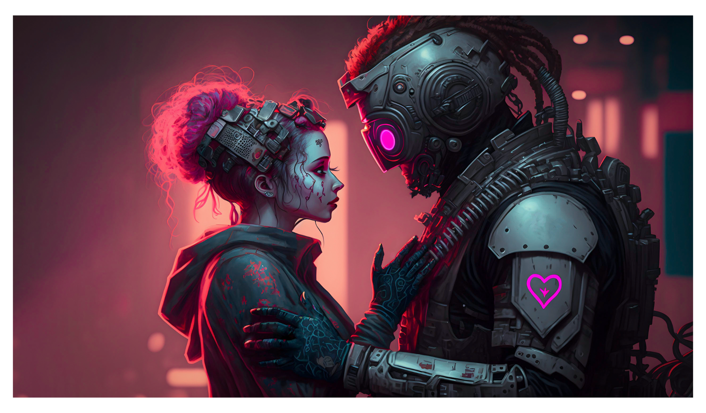

# Welcome to Carter!

<figure><figcaption></figcaption></figure>


**Sunset Notice** — **API**

We are sunsetting our public API on 01 September 2023. All characters are alive and waiting in [Carter Chat](https://carter.chat).

Read the full notice: [sunset-notice.md](api/sunset-notice.md "mention")


### What is Carter?

Imagine your players being able to converse with your characters in a deep, persistent way that propels your narrative and game into the future with generative AI.

### What can I use Carter for?

Carter has an unlimited number of potential use cases which will only grow over time. Some of the favourites include digital companionship platforms, conversational NPCs for immersive gameplay, mental health & depression support, virtual assistants and virtual & augmented reality applications.

### Join our [<mark style="color:purple;">Discord!</mark>](https://discord.gg/5bPYrJH2qn)

This is the main melting pot where it all goes down... Our discord is HQ of the Carter community, where people share their awesome projects, new startup ideas they want to see in the world, helpful resources and everything in between.

We also have dedicated sections to ask questions, get support, raise feature requests and let us know about bugs or issues. It's super chill and an absolute blast of a community that's open to all skill levels.\
\
Don't believe us? [<mark style="color:purple;">Come and see for yourself!</mark>](https://discord.gg/5bPYrJH2qn) <mark style="color:purple;">😁</mark>
