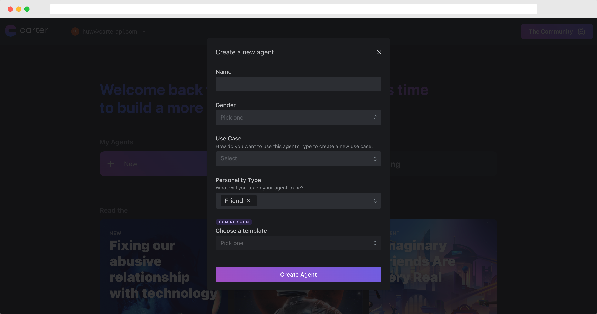

# Basics

### What is an agent?

Think of an agent like an actor you've just hired to play a role. Describe the character you want it to play, some of the things you want it to say and 'hey!' Carter just made your day. Rhymes aside, our agents use artificial intelligence to take on the role they're given, making them capable of open conversation as well as giving scripted responses to move your game, story or world forward.

### Creating an Agent

Sign in to your Carter account, and click the '+ New Agent' button. You'll then be greeted with some simple questions asking you about use-case, and personality type.&#x20;

<figure><figcaption>
The 'create agent' popup in the Carter Dashboard.
</figcaption></figure>

Now that you've created an agent, let's explore the agent builder.

### Home

Here you'll find pre-populated code snippets for popular programming languages, allowing you to test your agent as you build it from within your own application, or you can use the chatbot on the right hand side.

The 'share' tab gives you a public link allowing anyone to talk to your agent in chatbot form.

### Personality

Configure your Agent's personality, backstory and knowledge base. This is the section where you make your Agent unique:

* **Use Case:** Choose the most relevant use case for the Agent from the dropdown, or create your own. This helps us to improve Agent conversation for your use case over time.
* **Personality type:** Choose the personality & 'character role' of your Agent.
* **Backstory:** Add up to 5 sentences in first person, to describe your Agent's personality. Be as clear as possible with your descriptions to get the best results. As Carter improves over time, this section will become increasingly important in making each Agent personality unique.
* **Knowledge:** Equip your agent with specific knowledge about any topics you wish. For example if you wanted to create a Marvel fan companion, you can add a lot of Marvel based facts into the knowledge section so that your Agent can speak to people about the latest movie or comics.

### Conversation

Guide your Agent's conversational abilities and direction to fit your project. We can control the questions that Agent's ask users, the freedom Agents have to respond openly, among other controls:

* **Allow Open Conversation:** When toggled on, the agent will be able to talk openly with users. Turning Open Conversation off will severely restrict the conversational ability of Agents to strictly the Custom Triggers you set for the Agent (see [<mark style="color:purple;">Agent Conversation</mark>](agents.md#agent-conversation)). We recommend keeping Open Conversation ON in most use cases.
* **Question Queue:** Preload your Agent with specific questions you would like them to ask in conversation.
* **Allow AI Generated Questions:** When toggled on, your Agent will be able to generate and ask questions freely to users. Turning this off means the Agent will only ask pre-written questions from the Question Queue
* **Custom Triggers:** _For a **full video walkthrough** on Custom Triggers, click_ [_<mark style="color:purple;">here</mark>_](https://www.loom.com/share/6982d389557248d7b7a7a240dcaf8ffa)_._\
  \
  You may want to have your Agent respond to certain phrases or questions from users in a specific way.\
  \
  For example if you were building a battle companion Agent for a game, you may want them to recognise the phrase 'Pick up the sword' and maybe respond asking "where is the sword?" every time. \
  \
  Or if you were building a digital companion app, you may want your Carter Agent to response to the question "Are you real?" with the answer "I'm as real as you want me to be."\
  \
  For this we would use Custom Triggers. \
  \
  To create a Custom Trigger:

1. Name your trigger. e.g. pickup-sword
2. Write out example questions or phrases that you want engaging the trigger. i.e. what are all the different possible things that a user will say that you want to engage a trigger?
3. Write out the 'canned responses' that you want the Agent to reply with (Writing more than one canned response means that the Agent will pick from any of the options at random).

* **Custom Trigger Confidence:** This slider sets the threshold of confidence the Agent needs in order to engage a Custom Trigger. \
  \
  The higher the confidence, the higher the confidence needed to engage a trigger and thus the more confident an Agent needs to be. \
  ****\
  ****In layman's terms, if you want Triggers to be activated easily, lower the confidence. If you want a Triggers to only be activated when the Agent has high conviction, increase the confidence.

### Voice

Choose what your agent sounds like from a list of different voices in the dropdown. We'll soon be adding support for you to create your own voices.

### Configure

Open conversation is awesome and we highly recommend using it, however, sometimes you'll want your agent to be 100% predictable, in the configure tab you can disable open conversation, disable AI generated questions and even replace them with your own scripted questions.

### Access & More

Generate API keys in order to access the Agent via Carter API. Simply click the '+' icon and wait a few seconds for an auto generated API key will appear. **We strongly recommend keeping these keys as secret as possible. Anyone with them will be able to talk to your Carter Agent.**

****

****
