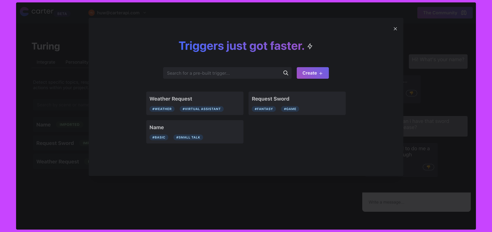

# Changelog

### April 1st, 2023

Version 1 of Carter enters private testing. Completely redesigned API, tools, docs and Controller!\
\
Still the same awesome Discord community.

### December 22nd, 2022

0.0.22

Minor changes to improve the workflow of adding and editing agent triggers. Previously, training would trigger every time you edited anything about a trigger, we now only train the agent when you've edited a model-relevant parameter such as "training phrases". We have also rearranged the "custom trigger library" popup to allow for improved browsing and navigation.

### December 5th, 2022

0.0.21

A slight jump in the version number here as we rolled out a number of versions with essentially no change to the developer experience. This version introduces the "information\_request" boolean for each agent response as well as some bug fixes introduced in 0.0.18.

* Bug fix - Custom triggers now respond consistently with an array data type.
* Bug fix - Custom triggers can respond without a canned response being set.
* Bug fix - custom triggers will now respond with NER/Entities when activated.
* New! - 'information\_request' now returns when the agent is requesting information before activating a custom trigger.\\

It may also be worth having a look at[ this page](broken-reference/) to get up to speed with the response structure changes that have compounded over the past few releases.

### November 23rd, 2022

0.0.18

<figure><figcaption>
Trigger Requirements example
</figcaption></figure>

Wow...it's been an embarrassingly long time between releases 🙈. Huw & Danny are both still alive we promise.\
\
Collecting further information is a challenge for any conversational experience, that's why we've been hard at working with "trigger requirements", the start of something beautiful...hopefully.

* \*\*\*\*[**Trigger Requirements**](broken-reference/) - Ask follow-up questions before activating a custom trigger!
* **Infinite Load** - Bug Fix (Dashboard)
* **Agent's sometimes not responding** - Bug Fix

### November 4th, 2022

0.0.17

<figure><figcaption></figcaption></figure>

Our goal is to create a new level of companionship between the users of your project and the characters powered by Carter, which is why we've upgraded our conversational engine to support multiple unique users for each agent! Over time the agent will get to know each user individually, keep track of multiple users conversations at once and you can even bring your own user identifiers!

**Conversational Engine**

* Multi-user support! Launching with unique conversations and user learning (experimental). Simply pass a unique string, representing each of you users, into the UUID parameter for each request.

**Dashboard**

* NEW! See trigger labels in the test chat!
* Save button is now sticky.
* Custom trigger metadata not saving? Fixed.
* Too much empty space on the agent builder? Fixed.
* 'Allow AI generated questions" not saving? Fixed.
* Light theme improvements.

### October 29th, 2022

0.0.16

* You can now delete API keys (useful if you leak them by accident and great for security hygiene).
* Switches for 'allow AI generated questions' and 'allow open conversation' now fixed.

Thanks for everybody that reported these issues on Discord!

### October 22nd, 2022

0.0.15

**We've used A.I to help train A.I.....yes it sounds ridiculous.**

<figure><figcaption></figcaption></figure>

What if instead of giving your agent 5-10 example phrases for each custom trigger, you could have Carter auto generate them from a single example?

In version 0.0.15 we are welcoming a much needed upgrade to 'example phrases' and 'responses' within the custom trigger configuration panel. Now simply add one example phrase and hit the 'generate' button. Carter will generate five different ways of saying your example phrase. Pretty sweet! This is a super beta feature so we welcome any feedback.

We've also ironed out a bug that prevented some triggers from training correctly.

### October 5th, 2022

0.0.14

Introducing... pre-made triggers!

<figure><figcaption>
The pre-made trigger library
</figcaption></figure>

Can't be bothered to make your own custom triggers? Now you can quickly import one of our pre-made triggers to save time and workload. **This library will continue to grow as Carter evolves and we encourage requests over on our Discord Server,** adding common use cases such as commands, common phrases and more. Once you've imported a pre-made trigger you can edit it just like a normal custom trigger. Pretty neat eh?

Also in this release we've:

* Consolidated the agent builder tabs.
* Replaced trigger 'threshold' with 'sensitivity'.
* Improved loading speed.
* Improved the integrate tab.
* Other minor improvements.

### September 27th, 2022

0.0.13

* Minor bug fixes and improvements.

### September 20th, 2022

0.0.12

What a week! Due to continued high usage and demand for faster agent response times, we're pleased to announce a few really meaningful changes.

**Speed** - We rebuilt our conversational engine with speed in mind this week. We've redcued response times by prioritising conversation over analysis, bringing our API responses for custom triggers down by a lot. Open conversation is still in "slow mode" while we're in early access.

**Entities** - Now only returned if "Detect entities" is enabled for a custom trigger. Date, Time & Number detection has been introduced **\[experimental]**.

**Sentiment Analysis** - Now supporting agent output and entire conversation analysis allowing you to gauge how well a conversation is going and what mood the agent is in.

**Account & Usage** - We're now launching a new section in the Carter Dashboard, aking it easy to track your API usage and purchase additional bundles of words should your project need it. _Each account is currently allowed 5000 input words per month for free._

### September 10th, 2022

0.0.11

<figure><figcaption>
The new custom trigger editor
</figcaption></figure>

**A new custom trigger editor**, making full use of a new tab layout, popup window and responsive card design for each custom trigger.

**Custom Trigger editor bug fixed**. Sometimes editing a custom trigger would edit a different trigger, leading to a confusing experience after creating or deleting items. Now fixed.

**Dashboard chat scroll issue fixed**. Every time you sent a message the window would scroll to to the bottom, this has now been fixed.

**Custom Trigger 'Save & Train' moved.** Save & Train now happens within each trigger popup rather than a confusing button at the top.

### September 9th, 2022

0.0.10

After a few minor bug fixes spanning 0.0.8 and 0.0.9 we're pleased to release another incremental improvement. This update marks the rollout of some more proactive changes to the Carter API, combing the learnings from our private Beta so far and the research we've been conducting.\
\
**Audio Endpoint \[Experimental]**: Allowing developers to send audio files to the API and get an agent response back. We handle speech recognition and then pass it to your chosen agent for standard processing. Because of this, the response looks the same as the[ /chat endpoint response.](broken-reference/)

### **August 20th, 2022**

0.0.7

.png>)

Two words - Screen. Space. We've introduced a new dashboard design, allowing for more efficient use of those ever-more-important pixels.\
\
**Light Theme** "never! I'll ever turn to the dark side!". For those stubborn people with strong retinas, you can now enable light theme of the portal for a breezy, positive vibe when you visit the dashboard.

**Bug Fixes** some users reported on Discord that they were having trouble typing in certain boxes. This should now be fixed.

**Improved Trigger Metadata editor.** Not much else to say here.

### **August 17th, 2022**

0.0.6

Based on our awesome Discord Community's feedback, we're pleased to announce another round of new features to ensure you are building on solid foundations.

**Trigger Confidence Removed.** There is no longer a global confidence threshold that applies to every trigger.

**Trigger-level sensitivity added.** Set the how confident you want your agent to be, for a **specific** trigger, before triggering a custom trigger. This can be found in the trigger editor.

**Trigger Metadata** attach application data to each custom trigger, reducing demand for client-side logic and load on your database. See how to access this from your agent's response [here](broken-reference/).

### **August 11th, 2022**

0.0.5

**Token Limit Removed!**\
\*\*\*\*For now, we've completely removed token limits for hobby agents, allowing developers to now get creative and build something awesome without limitations. Developers moving their agent to production will need to upgrade to an enterprise plan for faster inference and better support, to get started with this you can contact us via danny@carterapi.com.

**Named Entity Recognition (NER)** is now available in the API Beta. This allows for the detection of names, locations, organisations etc for each message sent to a Carter agent. Access this via 'entities' within your agent's response.

**Knowledge Confidence Threshold Lowered** allowing agents to more-often answer domain-specific questions from the given knowledge-base.

**1000 Word Limit** per message introduced to prevent API abuse.

**Delete Agents** a simple but highly requested feature. This is irreversible.
